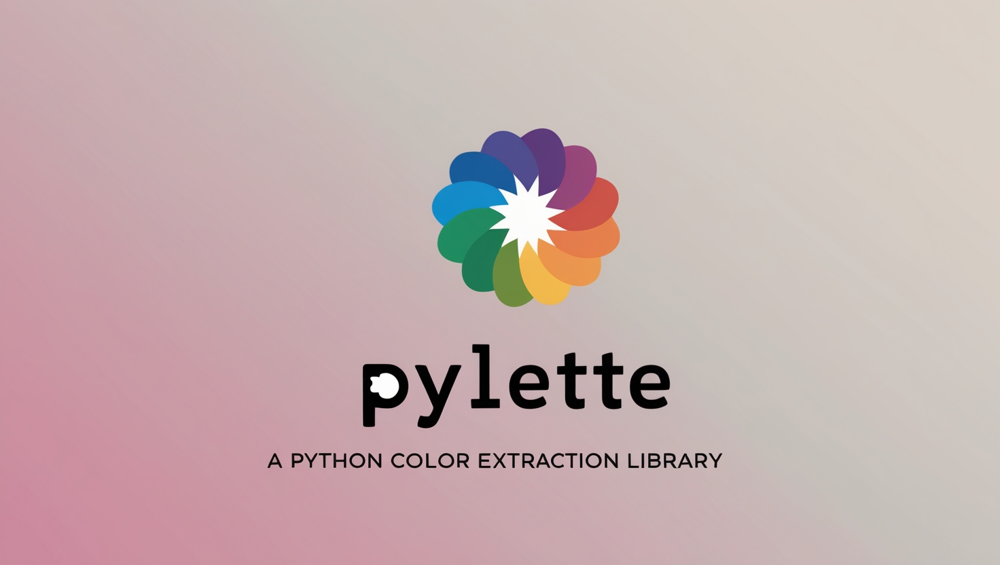

<p align="center">
  <a href="https://qtiptip.github.io/Pylette/"></a>
</p>
<p align="center">
    <em>Extract color palettes from images using the command line or Python library
</em>
</p>


[](https://badge.fury.io/py/Pylette)
[](http://pepy.tech/project/pylette)
[](https://squidfunk.github.io/mkdocs-material/)


---

**:material-book-open-page-variant: Documentation**: [https://qtiptip.github.io/Pylette/](https://qtiptip.github.io/Pylette/)

**:fontawesome-brands-github: Source code:** [qTipTip/Pylette](https://github.com/qTipTip/Pylette)

---

## What is Pylette?

Pylette helps you extract color palettes from images. Use the command-line interface for quick tasks or the Python library for more advanced workflows.

**Key Features:**
- Extract palettes from single images or batch process multiple files
- Export to JSON format with metadata and hex colors
- Support for different colorspaces (RGB, HSV, HLS)
- Handle transparent images with alpha channel masking
- Fast parallel processing for multiple images
- Rich progress display with color previews

## Getting Started

### Installation

You can easily install Pylette using pip:

```shell
pip install Pylette
```

Or if you prefer using uv:

```shell
uv add Pylette
```

## Command Line Usage

Extract palettes from images using simple commands:

!!! example "Basic Usage"

    ```bash
    # Extract 5 colors from an image (shows clean table output)
    pylette image.jpg

    # Process multiple images and export to JSON files
    pylette *.jpg --export-json --output results/

    # Extract 8 colors in HSV colorspace with structured export
    pylette photo.png --n 8 --colorspace hsv --export-json --output colors.json

    # Batch process with parallel processing and table display
    pylette images/*.png --n 6 --num-threads 4
    ```

**Example Output:**
```
✓ Extracted 5 colors from sunset.jpg
┏━━━━━━━━━━┳━━━━━━━━━━━━━━━━━┳━━━━━━━━━━┓
┃ Hex      ┃ RGB             ┃ Frequency┃
┡━━━━━━━━━━╇━━━━━━━━━━━━━━━━━╇━━━━━━━━━━┩
│ #FF6B35  │ (255, 107, 53)  │    28.5% │
│ #F7931E  │ (247, 147, 30)  │    23.2% │
│ #FFD23F  │ (255, 210, 63)  │    18.7% │
│ #06FFA5  │ (6, 255, 165)   │    15.4% │
│ #4ECDC4  │ (78, 205, 196)  │    14.2% │
└──────────┴─────────────────┴──────────┘
```

## Python Library

For programmatic usage and advanced workflows:

!!! example "Python API"

    ```python
    from Pylette import extract_colors

    # Extract palette with rich metadata
    palette = extract_colors(image='image.jpg', palette_size=8)

    # Access color properties with hex support
    for color in palette.colors:
        print(f"RGB: {color.rgb}")
        print(f"Hex: {color.hex}")
        print(f"HSV: {color.hsv}")
        print(f"Frequency: {color.freq:.2%}")

    # Export to structured JSON
    palette.to_json(filename='palette.json', colorspace='hsv')

    # Access metadata
    print(f"Source: {palette.image_source}")
    print(f"Extraction time: {palette.processing_stats['extraction_time']:.2f}s")

    # Simple export method
    palette.export('my_colors', colorspace='hls', include_metadata=True)
    ```

!!! example "Batch Processing"

    ```python
    from Pylette import batch_extract_colors

    # Process multiple images with parallel processing
    results = batch_extract_colors(
        images=['image1.jpg', 'image2.png', 'image3.jpg'],
        palette_size=8,
        max_workers=4,
        mode='KMeans'
    )

    # Handle results
    for result in results:
        if result.success and result.palette:
            print(f"✓ {result.source}: {len(result.palette.colors)} colors")
            result.palette.export(f"{result.source}_palette")
        else:
            print(f"✗ {result.source}: {result.error}")
    ```

The Python library provides full programmatic access to all CLI features plus detailed metadata and customization options.

!!! tip "Working with Transparent Images"

    For images with transparency (PNG files with alpha channels), you can use the `alpha_mask_threshold` parameter to exclude transparent or semi-transparent pixels:

    ```python
    from Pylette import extract_colors

    # Extract colors from a transparent PNG, ignoring pixels with alpha < 128
    palette = extract_colors(
        image='transparent_image.png',
        palette_size=10,
        alpha_mask_threshold=128
    )
    ```

    The `alpha_mask_threshold` parameter accepts values from 0-255, where pixels with alpha values below this threshold are excluded from color extraction.

## JSON Export Format

Pylette exports rich JSON data:

!!! example "JSON Structure"

    ```json
    {
      "colors": [
        {
          "rgb": [142, 152, 174],
          "hex": "#8E98AE",
          "frequency": 0.25
        }
      ],
      "palette_size": 5,
      "colorspace": "rgb",
      "metadata": {
        "image_source": "photo.jpg",
        "extraction_params": {
          "palette_size": 5,
          "mode": "KMeans"
        },
        "processing_stats": {
          "extraction_time": 0.234
        }
      }
    }
    ```

Different colorspaces use semantic field names:
- **RGB**: `{"rgb": [255, 128, 64], "hex": "#FF8040", "frequency": 0.25}`
- **HSV**: `{"hsv": [0.08, 0.75, 1.0], "rgb": [255, 128, 64], "hex": "#FF8040", "frequency": 0.25}`
- **HLS**: `{"hls": [0.08, 0.63, 0.75], "rgb": [255, 128, 64], "hex": "#FF8040", "frequency": 0.25}`

## Export Options

Control how your palettes are saved:

!!! example "Export Commands"

    ```bash
    # Individual JSON files for each image
    pylette *.jpg --export-json --output palettes/
    # Creates: palettes/palette_001.json, palettes/palette_002.json, etc.

    # Combined JSON file with all palettes
    pylette *.jpg --export-json --output all_colors.json

    # Export with different colorspace
    pylette image.jpg --colorspace hsv --export-json --output hsv_palette.json

    # Suppress table output, only export JSON
    pylette *.png --export-json --output results/ --no-stdout
    ```


## Example Palettes

Check out these palettes extracted using Pylette! The top row corresponds to extraction using K-Means, and the bottom
row corresponds to Median-Cut extraction.
The colors are sorted by luminosity.


Original Image  | Extracted Palette
:--------------:|:-----------------:
 |  
 |   
 |    

## How Pylette Works

Pylette uses various color quantization algorithms to extract the most representative colors from your images.
Currently, it supports:

1. K-Means clustering
2. Median-Cut algorithm

## We'd Love Your Feedback And Contributions!

Pylette is an ongoing project, and we're always looking to improve it.
If you have any suggestions, questions, or just want to share how you're using Pylette, please don't hesitate to reach
out, or make a pull request on our GitHub repository.

Happy color extracting!
